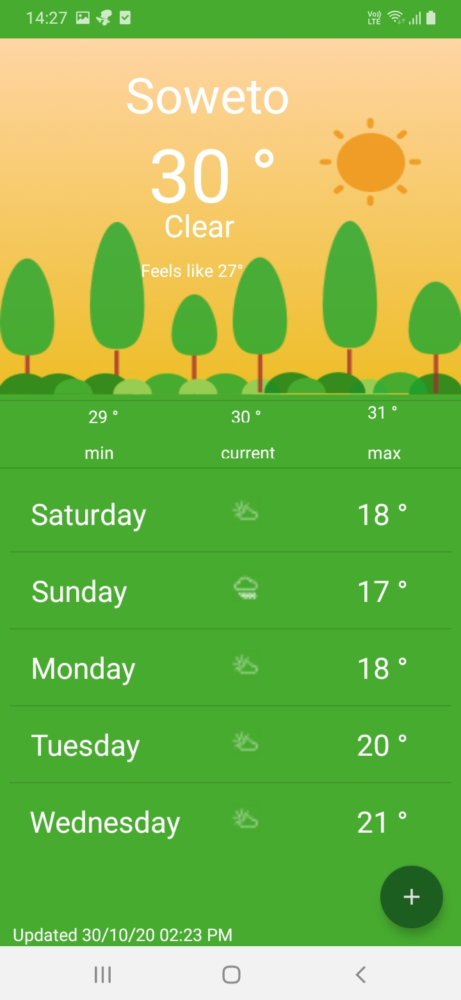
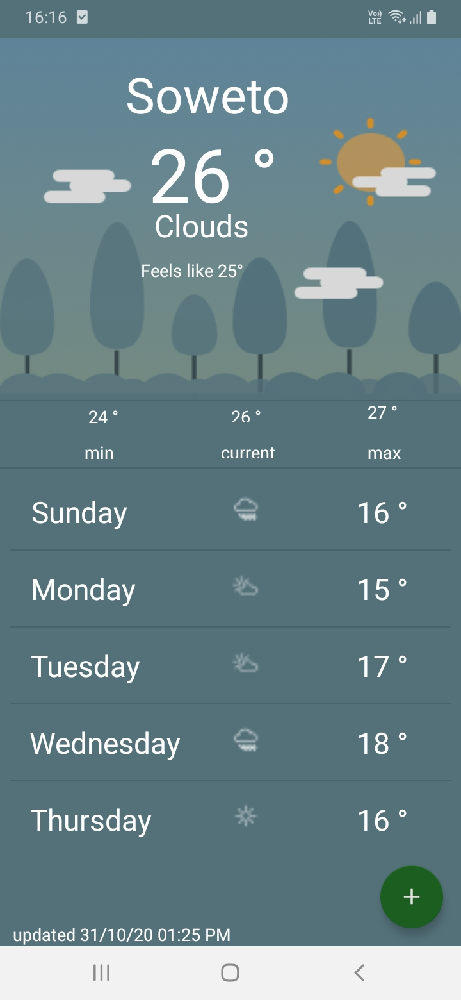
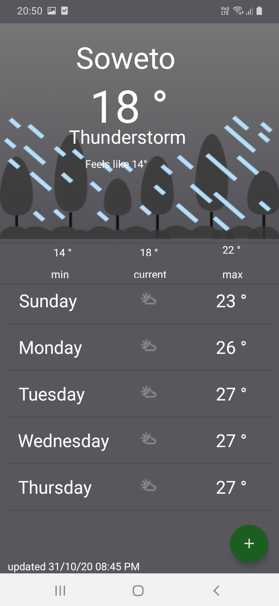
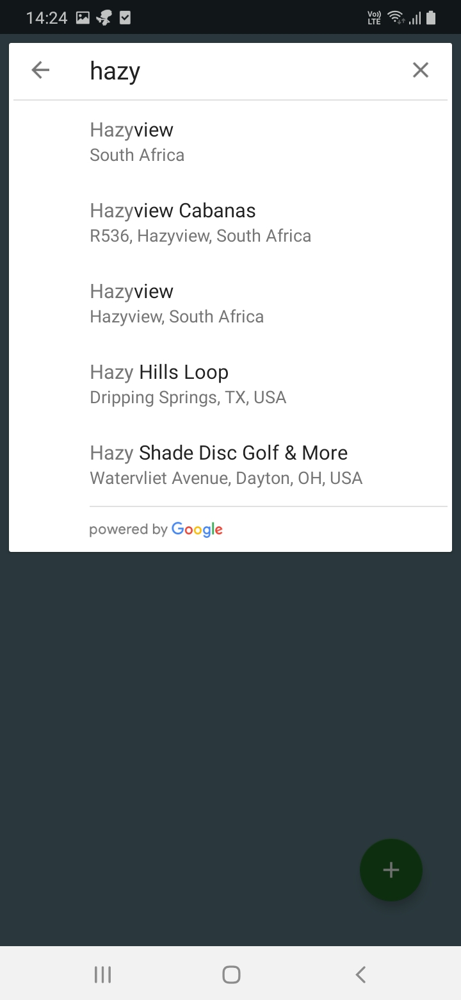

# Weather App
The weather App consume data from openweatherapi,particular current and five day forecast data and display the data on the view.
The app load data using Retrofit2 and save the data in room database. Obsevations of data change is accomplished by kotlin coroutines and then update the recyclerview.

The app folows the MVVM architecture.

The App theme update based on the current weather condition. Conditions are rainly/thurnderstom,cloudly,sunnly/clear.
Lastly users are able to add their desired place to view weather.

# 1 Sunny/Clear

# 2  Cloudy

# 3  Rainly/Thurnderstom

# 4  Add Place

